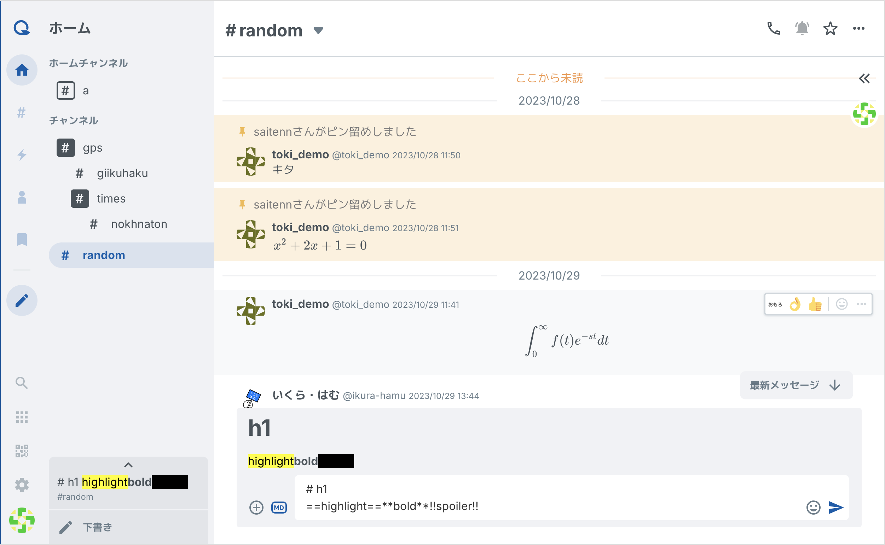
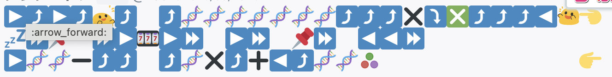
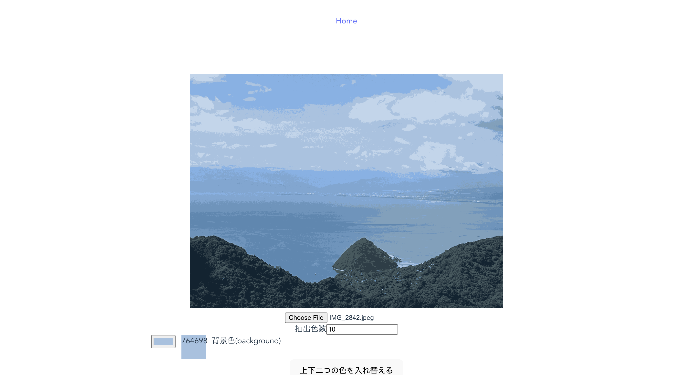
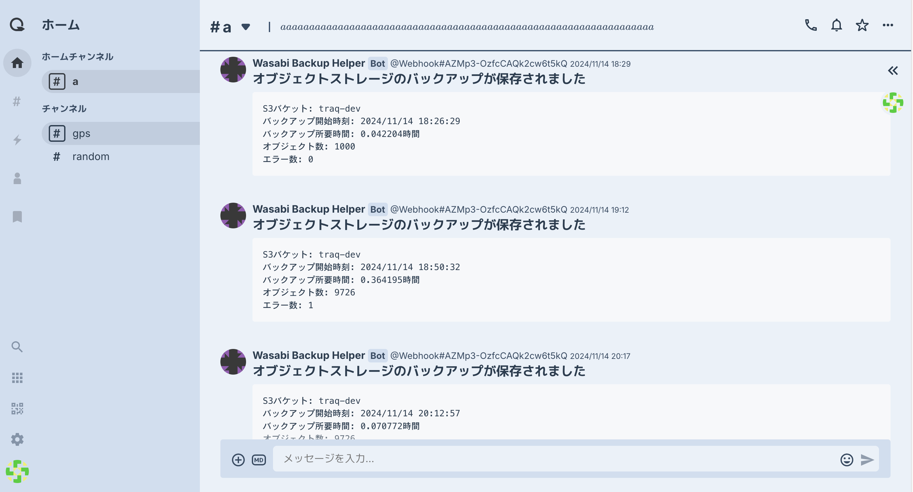
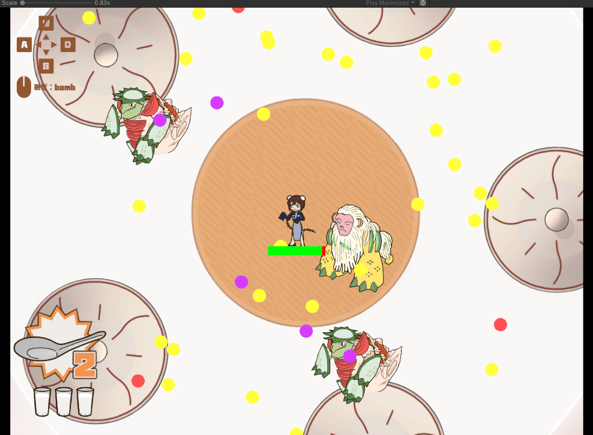
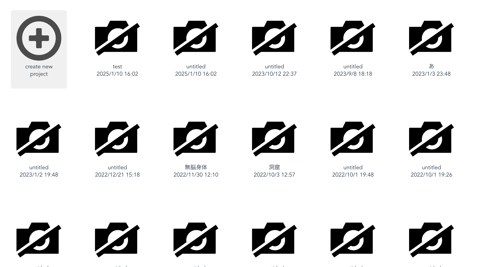
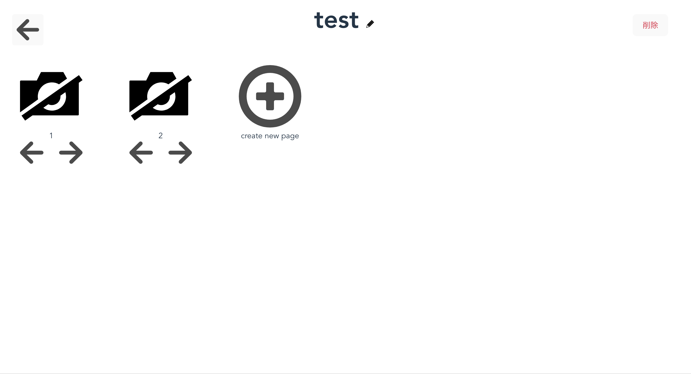
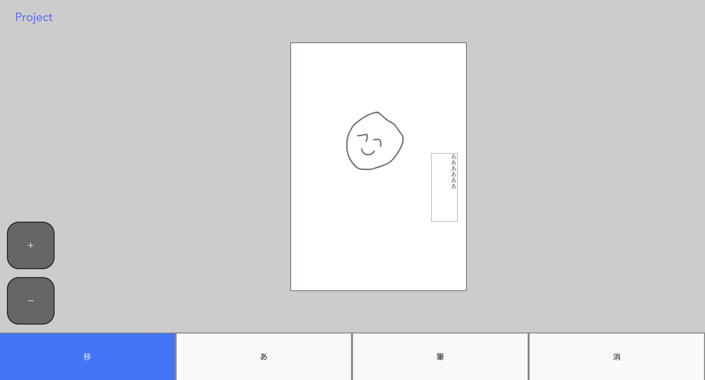

# プロフィール

東京科学大学デジタル創作同好会 traP SysAd 班所属

[traQ_S-UI](https://github.com/traPtitech/traQ_S-UI)のメンテナなど web フロントエンド開発を中心に、ゲーム開発やバックエンド開発も行っています。

## 制作作品

### [traQ_S-UI](https://github.com/traPtitech/traQ_S-UI)

2022 年春から参加、2022 年秋よりメンテナー

traP 部員が日常的に使う部内で運用している SNS「traQ」のフロントエンドです。
ツリー型のチャンネル構造を特徴として、開発とユーザーの距離が近いメリットを活かして開発しています。
現在では最大 500 人以上のユーザーにより 5800000 以上のメッセージが投稿されています。

traQ 開発環境の様子

### [web エンジニアになろう講習会](https://traptitech.github.io/naro-text/?ref=trap.jp)

traP 新入部員や web 初心者の部員を対象にした、web 開発の基礎を学ぶ講習会です。講習会は座学編と実習編で構成されており、座学編で基本的な概念や全体像を確認した後、実習編で実際に作成することで理解を深めていく構成になっています。
私がフロントエンドの講師を務めた 2023 年度は従来部内でのみ共有されていた資料をリファクタリングして vitepress に移行、一般に公開しました。
また、web エンジニアになろう講習会の前に行われる Web 基礎講習会の 2023 年度、2024 年度の講師も務め、資料や演習内容のリファクタリングを行いました。

[2023 年度 Web エンジニアになろう講習会 講師ブログ](https://trap.jp/post/1969/)

### [QBrain](https://qbrain.trap.show)

2023 年度の部内春ハッカソンで作成した自作難解プログラミング言語です。
3 次元的にコードを書く Brainf\*\*k をテーマに 2 日間で開発しました。
2 次元的に広がるスタックを 3 次元的に書かれたコードで操作します。
足の向きと顔の向きを持つオペレーターが一歩づつ前に進みながら命令をこなしていくイメージです。
traQ 上でコードを共有しやすいように、ASCII のコードの他に traQ で使えるスタンプの形式でも動作します。

traQ 上で共有される例

命令の詳細は[QBrain.md](QBrain.md)を参照してください。

### [traQ theme generator](https://traq-theme-generator.trap.show/#/)

traQ のテーマを画像から生成するツールです。
クラスタリングを使って色を抽出し、ピクセル数の多い色をベースにテーマを生成します。
背景色や UI 色はコントラストが一定の値以上になるように生成しているため、特に調整しなくてもある程度読みやすいテーマを作ることができます。

リポジトリ
https://github.com/nokhnaton/traQ_Theme_Generator

自動生成されたテーマ

### 角宿菜館

2023 年冬ハッカソンで作成した 弾幕ローグライトゲームです。
ミュータント中華を倒して敵と味方をどちらも強化するアイテムを選択していきながら生き残るゲームです。

### Ez-tooN

2022 年 DIGI-CON HACKATHON で作成した web アプリです。
Hack MD のようにパッとひらけて下書きできるイラストアプリです。

